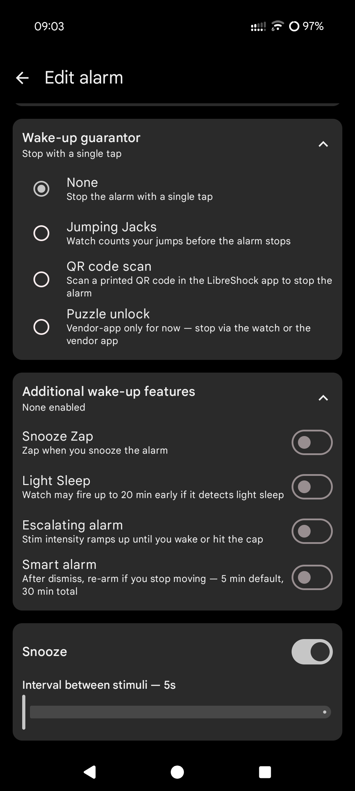
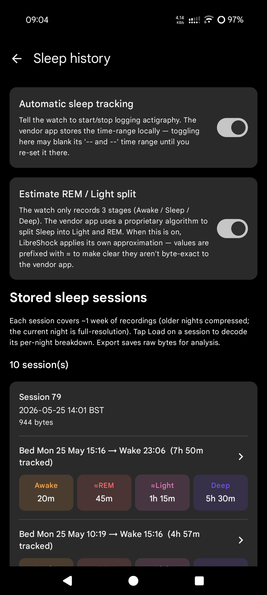

# LibreShock

> **WARNING: AI Slop Coded**
>
> This software was AI slop coded. While it has been tested, do not use
> this in mission-critical situations. Use at your own risk. The code may
> contain bugs, security issues, or unexpected behavior.

---

LibreShock is a Python library + Android app that talks BLE to Pavlok
Devices without the vendor app. The BLE protocol was reverse-engineered
from adb btsnoop captures of the vendor app and is documented in
[CLAUDE.md](CLAUDE.md).

Two interfaces:

- **`libreshock.py`** — Python CLI (uses [bleak](https://github.com/hbldh/bleak))
- **`android/`** — Kotlin / Jetpack Compose Android app

## Features

- Trigger vibrate / beep / zap (with adjustable intensity)
- Manage alarms: list, create, edit, enable/disable, delete, per-day repeats
- Set a wake-up guarantor on any alarm — Jumping Jacks (counted on the
  watch), [QR code scan](docs/images/libreshock-qr.png), or Puzzle unlock
  (memory grid or arithmetic equation, randomly picked; toggleable in
  Settings)
- Stack any combination of the watch's "Additional wake-up features"
  on any alarm — Snooze Zap, Light Sleep, Escalating Alarm, Smart Alarm
- Configure the watch's Timer and Stopwatch with one or more recurring
  stim intervals (vibe / beep / zap, every N seconds)
- List sleep sessions stored on the watch and decode per-night summaries
  (bedtime, wake-up, Awake/Sleep/Deep totals). The watch only records
  3 stages; an optional setting (default off) applies an approximate
  Light/REM split phone-side, labelled with `≈` to show it isn't byte-
  exact to the vendor's proprietary algorithm. Android adds a per-night
  detail screen with a multi-coloured line-graph sleep chart and a
  Save raw bytes button (system file picker) for offline analysis.
- Stop or snooze a currently-firing alarm from the phone / desktop
- Validate the alarms on the watch — re-reads them and checks the raw
  armed-state bytes for internal-consistency bugs (e.g. an alarm that
  looks disabled but would still fire), plus diffs each field against
  what the app shows. Surfaces silent bugs immediately rather than at
  the next alarm time. Available as the Alarms-screen Validate button
  in Android and `python libreshock.py alarm --validate` in the CLI.
- Configure hand-raise detection: enable, wrist hand/position, stimulus
  (vibrate / beep / zap / countdown), zap intensity
- Rebind the watch's 3 hardware buttons: short + long press for each can
  trigger a stim (with repetition + intensity), toggle the built-in
  stopwatch / timer apps, toggle sleep tracking, or be disabled
- Enable / disable automatic sleep tracking
- Read battery level
- Read device info: name, manufacturer, model, serial, firmware / hardware
  revisions, on-device clock, timezone
- *(Android only)* Battery history graph, live connection state and
  auto-reconnect, Bluetooth-off detection with one-tap re-enable, full
  alarm CRUD UI with Material 3 TimePicker, in-app alarm-fire dialog
  plus a system notification with Stop / Snooze actions (works while the
  app is in the background — see *Limitations* below)
- *(Android only)* Opt-in **update check** — Settings → "Check for
  updates automatically" pings the GitHub Releases API once a day and
  shows a snackbar with a link to the Releases page when a new tag is
  available. Off by default; turning it on deep-links to system app
  info so you can confirm LibreShock is allowed to use the network.
- Opt-in **Remote API** — an HTTP server that lets other devices on your
  network (Home Assistant, scripts, smart-home gear, etc.) trigger
  vibrate / beep / zap / alarm-stop on the watch. Token-authenticated,
  off by default. Available as the Android app's `Settings → Remote API`
  sub-screen (runs as a foreground service while on), and as the
  standalone `libreshock_server.py` Python script. Full spec in
  [docs/API.md](docs/API.md).

## Status

Tested against:

- **BLE Name Pattern**: `Pavlok-*` (e.g. `Pavlok-3-XXXX`) and the shorter
  `Pav<model>-*` scheme (e.g. `Pav4-8cbf`) — both are matched
- **Manufacturer**: Behavioral Technology Group, Inc.
- **Model**: Pavlok-S (Pavlok 3)
- **Hardware**: 6.0.0
- **Firmware**: 6.10.0

Other Pavlok models likely share the same protocol but are untested. (I do not own any other Pavlok device, if there are issues please create an issue with logs and I will try my best to support it)

### Pavlok 4 / Shock Clock Max — currently unsupported

A user-supplied debug scan of a **Pavlok 4** (marketed as the
**Shock Clock Max**; BLE name `Pav4-XXXX`, manufacturer "Pavlok Inc.",
firmware `1.4.35.999`) confirmed that it ships with an **entirely
different BLE service layout** from the Pavlok 3:

- Pavlok 3: vendor services `156e1000`, `156e2000`, `156e5000`, `156e7000`
  with documented characteristics for vibe / beep / zap / alarm / etc.
- Pavlok 4: a single command-channel service `66651000-39f4-11ed-92bd-832abac11ab4`
  (two characteristics, write-no-resp + notify) plus an auth/identity
  service `66657000-39f4-11ed-...`. None of the Pavlok-3 characteristics
  exist.

LibreShock detects this at connect time and shows an *"Unsupported device"*
status rather than silently failing every operation. Adding Pavlok-4
support is a separate reverse-engineering effort comparable in scope to
the original Pavlok-3 work — captures from a Pavlok 4 user willing to
follow [docs/btsnoop-capture.md](docs/btsnoop-capture.md) would be the
biggest unblock. Track / contribute on the
[Pavlok 4 support issue](https://github.com/hairyfred/LibreShock/issues).

If your watch doesn't work with LibreShock, please export a debug log and attach it to a [GitHub issue](https://github.com/hairyfred/Libreshock/issues):

- **Android app**: Settings → **Export debug log**. Leave "Censor sensitive info" ticked unless you're comfortable sharing your MAC / serial publicly, then use the share sheet to send the `.txt` file to yourself and attach it to the issue.
- **Python CLI**: `python libreshock.py debug --censor > debug.txt`, then drag-and-drop `debug.txt` onto the new GitHub issue.

The log contains the full GATT tree, characteristic values, battery level and firmware/hardware revisions — enough for us to extend protocol support to your model.

## Python CLI

```
pip install bleak

# Show the watch's name, model, serial, firmware, clock and timezone
python libreshock.py info

# Vibrate at 100% intensity, 3 pulses
python libreshock.py vibe -i 100 -c 3

# Set a recurring 07:30 Wednesday alarm with all three stimuli
#   --vibe 50      vibrate at 50%
#   --beep 70      beep at 70%
#   --zap 30       zap at 30%
#   --interval 15  15 seconds between stimulus rounds
python libreshock.py alarm -t 7:30 --days wed --vibe 50 --beep 70 --zap 30 --interval 15
```

Full command reference: **[docs/CLI.md](docs/CLI.md)**.

## Android app

| Main | Alarms | Edit alarm |
|------|--------|------------|
|  |  |  |
| **Wake-up features** | **Hand raise** | **Sleep history** |
|  |  |  |

Pre-built signed APKs are attached to each release on the
**[Releases page](https://github.com/hairyfred/Libreshock/releases)** — grab
the `libreshock-vX.Y.Z.apk` from the latest release, transfer to your phone,
and install (you'll need to allow installs from unknown sources).

To build it yourself: project lives under `android/`. Open in Android Studio,
build, and install on a connected phone with USB debugging on. Min SDK 26
(Android 8.0).

Permissions: `BLUETOOTH_SCAN` and `BLUETOOTH_CONNECT` (API 31+); falls
back to `ACCESS_FINE_LOCATION` on older Android. `POST_NOTIFICATIONS`
(Android 13+) for the alarm-firing notification. `INTERNET` is declared
but only used by the opt-in update checker — no data is sent to GitHub,
just a GET on the public Releases API. `CAMERA` is requested by zxing
the first time you trigger a QR-guarded alarm scan. All runtime-
requested except `INTERNET` (normal permission, granted at install).

### Limitations

The alarm-firing notification is **process-alive only** — there's no
foreground service. The watch only emits the alarm-fire BLE packet to
something actively connected, so the app needs to be running (foreground
or backgrounded) to receive it and post the notification. If you swipe
LibreShock away from Recents, the BLE connection drops and you'll only
get the alarm on the watch itself (which is what the watch is for —
this is a convenience layer, not a replacement). A future foreground-
service mode could keep the connection alive indefinitely at the cost
of a permanent notification icon and some battery; not implemented yet.

From the command line, with Android Studio's bundled JDK on `JAVA_HOME`:

```
cd android
./gradlew :app:installDebug
./gradlew :app:testDebugUnitTest
```

The unit tests verify the Kotlin protocol output byte-matches captured
vendor-app packets (alarms, timer/stopwatch, sleep-history decode) —
same validation as `scripts/verify_combos.py` for the Python
implementation.

## Repository layout

```
libreshock.py        Python CLI (reference implementation)
libreshock_server.py Optional aiohttp HTTP server exposing the Remote API
parse_btsnoop.py     btsnoop_hci.log parser used during RE
android/             Kotlin / Compose Android app
  app/src/main/.../ble/        Protocol + BLE wrapper
  app/src/main/.../ui/         Compose screens
  app/src/test/.../             JUnit tests (byte-exact protocol verification)
scripts/
  extract_alarm_writes.py      Decode alarm transactions from a btsnoop
  verify_combos.py             Byte-exact test vs captured vendor packets
  parse_alarm_packet.py        Decode a single packet
  timeline.py                  Chronological dump of writes/notifications
  decode_sleep_capture.py      Reassemble + decode sleep-history response from a btsnoop
  generate_qr.py               Regenerate the bundled alarm-stop QR PNG
docs/images/libreshock-qr.png  Printable alarm-stop QR (QR guarantor)
CLAUDE.md            Full reverse-engineered protocol documentation
```

## Protocol

The BLE protocol — services, characteristics, alarm packet format, day-mask
encoding, CRC algorithm, fire/stop/snooze commands — is fully documented
in [CLAUDE.md](CLAUDE.md). That file is the canonical reference.

## Credits

LibreShock is MIT-licensed but ships on the shoulders of several open-source
projects:

- **[bleak](https://github.com/hbldh/bleak)** (MIT) — cross-platform BLE
  library powering the Python CLI.
- **[zxing-android-embedded](https://github.com/journeyapps/zxing-android-embedded)**
  (Apache 2.0) — barcode/QR scanner used by the Android app's
  "scan-to-stop" alarm guarantor.
- **[ZXing core](https://github.com/zxing/zxing)** (Apache 2.0) — the
  decoder zxing-android-embedded wraps.
- **[Konfetti](https://github.com/DanielMartinus/Konfetti)** (ISC) —
  the confetti animation shown on successful alarm dismissal (toggleable
  in Settings, off by default).
- **AndroidX / Jetpack Compose / Material 3** (Apache 2.0) — the Android
  UI toolkit.

## Disclaimer

This is an **unofficial project**. LibreShock is not affiliated with,
endorsed by, sponsored by, or in any way officially connected to Behavioral
Technology Group, Inc. or Pavlok. "Pavlok" and any related product names are
trademarks of their respective owners and are used here solely to identify
the hardware this project targets. The protocol implemented here was
reverse-engineered from publicly observable Bluetooth LE traffic for personal
interoperability purposes.
